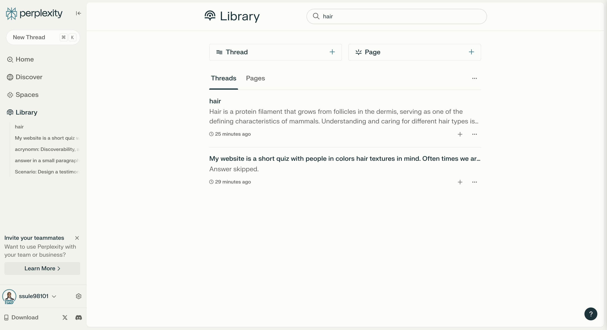
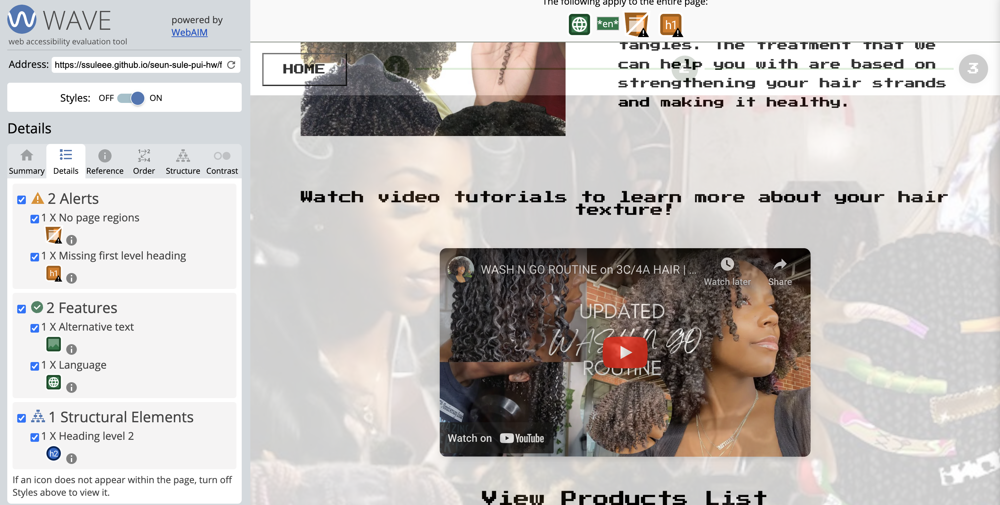

<mark>**Note that this document order from FP4 -> FP1**</mark>

<mark>Please sign up for the study</mark> at [https://tinyurl.com/pui-study](https://tinyurl.com/pui-study) to allow us to use your submission to create a better GenAI assistant for designers!

---

# **FP4 \- Final Project Writeup**

Feel free to refer to this [Markdown Cheat Sheet](https://www.markdownguide.org/cheat-sheet/) to make your writeup more organized, and you can preview your markdown file in VSCode [Markdown editing with Visual Studio Code](https://code.visualstudio.com/docs/languages/markdown#_markdown-preview).

## Part 1: Website Description

My website is a unique and empowering platform designed to celebrate and cater to the diverse beauty of Black women's hair. The primary purpose of this website is to provide a personalized hair care experience through an interactive quiz that focuses on various hair textures often overlooked in the mainstream beauty industry.

The target audience is specifically Black women and individuals with textured hair who have felt underrepresented in traditional beauty spaces. This website aims to create an inclusive environment where users can find tailored advice and product recommendations that truly understand and address their specific hair care needs.

Through the quiz, it educates users on proper hair maintenance, styling techniques, and product selection based on their individual hair characteristics. What makes this website particularly interesting and engaging is its thoughtful design and user experience. The quiz features intentionally slower transitions between questions, creating a reflective and immersive journey that allows users to connect with their hair care experience on a deeper level. This pacing encourages users to truly consider each aspect of their hair and its needs, fostering a sense of self-appreciation and mindfulness.

## Part 2: User Interaction

1. Initial Page Load and Start

   - Interaction type: Page load and button click
   - Reproduction:
     - Open the index.html page in a web browser
     - Locate and click the "Start Now" button on the page

2. Quiz Navigation

   - Interaction type: Multiple choice selection and conditional page routing
   - Reproduction:
     - Answer the quiz questions by selecting either "Yes" or "No" options
     - Based on the answers, the user will be automatically directed to either:
       - low_porosity.html (if answers indicate low porosity)
       - high_porosity.html (if answers indicate high porosity)

3. Porosity Page Interaction

- Interaction type: Video playback and external link navigation
  - Reproduction:
  - On the porosity page (either low or high), locate the embedded YouTube video
  - Play the video to watch hair care information
  - Find the "Product Recommendations" button or link
  - Click on the "Product Recommendations" to open a new tab or window
  - The new page will display product recommendations tailored to the user's hair porosity type

4.

## Part 3: External Tool

1. GSAP (GreenSock Animation Platform)

   - I chose GSAP for its flexible animation capabilities, which allow me to create smooth and engaging transitions in my web application. I thought it was nice that it provided cross-browser compatibility which made it useful for creating the interactive experience I envisioned for my hair quiz website.
   - I implemented GSAP by including the minified JavaScript file from a CDN link in my HTML. This allows me to use GSAP's animation methods and timeline features throughout my website .
   - I added GSAP to my website by because it added a sense of creativity and inspiring new change to my entire website with animations.

2. Google Fonts (Press Start 2P)
   - I chose the "Press Start 2P" font from Google Fonts to give my website a unique, retro-inspired aesthetic that aligns with the welcoming nature of my hair quiz.
   - I implemented this font by importing it using a CSS @import rule at the top of my styles.css file.
   - This custom font adds a visual style to my website, i thought it would appeal and make the text elements more engaging for users as they progress through the hair quiz.

## Part 4: Design Iteration

During the implementation of my website, I made several iterations to improve the user experience and functionality. I began with using my figma mockups from FP2 as guide and as i created the site and got feedback i was told that using a plain white background at the start of the quiz to minimize distractions would help user. To enhance navigation, I added a home button, allowing users to easily return to the beginning of the quiz. I also incorporated more animations to make the interface more engaging.

Recognizing the need for clarity, I also introduced a imaage on hair porosity portion of the quiz, helping users better understand this crucial quiz question. The development process involved 3-4 iterations before reaching the final product. Lastly, based on usability testing, I improved accessibility by adding alt text for images and using darker colors for progress bar between quiz steps, making the progression more visually apparent.

## Part 5: Implementation Challenge

Implementing a visually appealing design that accurately reflects the goals for people with textured hair was a significant challenge for me. Balancing aesthetics with functionality required careful consideration of color schemes, typography, and layout to create an engaging user experience. The progress bar was initially difficult to implement, but resources like W3Schools provided valuable guidance in overcoming this hurdle. Creating a design that resonates with my target audience while maintaining usability and visual appeal was a complex task that required iterative refinement and attention to detail.

## Part 6: Generative AI Use and Reflection

I used Perplexity to help me with my project. As I received feedback from my peers, I found it sometimes challenging to accurately translate my thoughts into code. However, I challenged myself to overcome these difficulties. I watched videos that demonstrated similar features to what I wanted for my website, which helped me understand how to implement certain functionalities. This approach of combining AI assistance with self-directed learning through video tutorials was prettyeffective in helping me complete my project while also improving my coding skills.

### Usage Experiences by Project Aspects

| Tool Name  | Ratings      | design | plan | write code | debug | \_ (other?) |
| :--------- | :----------- | :----- | :--- | :--------- | :---- | :---------- |
| Perplexity | Usage        | Yes    | Yes  | Yes        | Yes   | No          |
| Perplexity | Productivity | 5      | 6    | 6          | 5     | N/A         |

### Usage Reflection

> Impact on your design and plan

- It matched my expectations and plan in [FP2](#generative-ai-use-plan) in that … For example,
  1. Perplexity: was super useful for debugging and getting a understand of what would be the best way to go about my code. Sometimes I found myself having long lines of code but it was helpful to find a shorter way and understanding it.
  2. Tool2:
- It did not match my expectations and plan in [FP2](#generative-ai-use-plan) in that … For example,
  1. Perplexity: I thought I needed it more but since I challenged myself to use resources like w3schools, google, and youtube, I found that more helpful. Perplexity was used when I might have hit a roadblock but I was able to keep myself together and learn while creating a website for a topic I enjoyed.
  2. Tool2:
- GenAI tool did/did not influence my final design and implementation plan because … For example,
  1. Perplexity: I depended heavily on my peer feedback and my orginial design goals to help guide my website. As I got feedback I changed design rather then let Perplexity change it for me. This allowed me to keep my creative outlook on my project.
  2. Tool2:

> Use patterns

- I accepted the generations when … For example,
  1. Perplexity: this tool once suggested I adjusted my alt text to be more descriptive according to the suggestion I changed it because it would be more accesible for those using screen reader, and etc.
  2. Tool2:
- I critiqued/evaluated the generated suggestions by … For example,
  1. Perplexity: this tool once suggested use a dark theme for my progress bar but I rejected as it doesn't help with usuability.
  2. Tool2:

> Pros and cons of using GenAI tools

- Pros
  1. Perplexity: It was helpful when it came to debugging and coming up with additonal ways for me to figure out different animations I could use.
- Cons
  1. Perplexity: It sometimes changed everything I did and didnt properly convey what I needed helped with.

### Usage Log

Throughout my project, I relied heavily on Perplexity as I found it more helpful than other AI tools I had used in my classes. I utilized Perplexity from the beginning of my project until its completion. One advantage I noticed is that Perplexity seems to save my data within my account, allowing for some continuity in my queries.

However, the data retention appears to be selective. For instance, when I search for "hair" in my query history, it only displays the two most recent submissions related to that topic. This selective history could be due to the way Perplexity manages user data or updates its database.
I'm uncertain about whether refreshing the page or starting a new session affects the saved data. It's possible that initiating a new submission might reset or update the available history.

To illustrate how I used Perplexity, I've included my latest submission as an example. This demonstrates the kind of queries and assistance I sought from the AI tool during my project development.
Using Perplexity throughout my project helped me tackle various challenges, from conceptual questions to specific coding issues. Its ability to provide context-aware responses based on my project's progression was particularly useful in maintaining consistency and building upon previous work.

### Appendix

---

# **FP3 \- Final Project Check-in**

Document the changes and progress of your project. How have you followed or changed your implementation & GenAI use plan and why? Remember to commit your code to save your progress.

## Implementation Plan Updates

- [ ] I changed the background based off of feedback from presentation. The background was suggested to be white so that users can focus and it can be visually appelaing. I also added animation effect to the title and when users go on to the next page. I also added a way for the user to go back to the main page to restart the quiz.

## Generative AI Use Plan Updates

- [ ] I've plan to use AI to help me with understanding ways I can implement my code. For example asking it what are ways to make my website more technical, or if I am having trouble with a bug issues I can ask it to help find another way that I am not seeing how to change it to work.

Remember to keep track of your prompts and usage for [FP4 writeup](#part-6-generative-ai-use-and-reflection).

---

# **FP2 \- Evaluation of the Final project**

## Project Description

As someone who has experince not being familar with there hair texture this was something that was very improtant to me. Many woman of color who have my hair texture or thicker experince not knowing how to style it and what products to use. Liseenced stylist also dont know how to do our hair properly since it actually isnt taught in beauty school circulloum. Although its encourgaged to work on our thick hair it hard to go to stylist who can recommend proper products and do hair styles for us. This will be a good for people who have coily hair texture to learn more about how to take care of their hair.

## High-Fi Prototypes

### _Prototype 1_

I changed my entire idea as I wanted to relate to my project and informed my TA of these changes. Based on the user feedback from the prototype 1 high-fidelity testing, I identified two key areas for improvement. There was multiple entry point confusion. Users expressed uncertainty about where they were entering the application. The initial interface was perceived as resembling a beauty advertisement rather than a haircare platform. This feedback helped me in understanding I need to clarify the purpose and context of my website upon entry. For the second page design, while users found the content of the second page valuable, they felt its visual design was underwhelming. This feedback helped me realized that the page lacked visual appeal and engagement, despite containing useful information.

### _Prototype 2_

## Usability Test

Based on the user feedback from my user testing, I have added new feautures to improve the application's functionality and user experience. I added a new feature that allows users to view their specific hair texture, categorized by porosity levels. To address the feedback about blandness, I incorporated an inviting background to make the interface more visually appealing. I also created an entirely new page dedicated to providing tailored recommendations for users based on their specific hair type. This page includes an explanation of the user's selected hair type from the previous page, a "View Curated List" feature offering personalized product recommendations, and an information section with detailed explanations of various hair types, such as Type 4a. I also wanted user to enjoy the walk through of learning about there hair as well, so I made the background photo curated to women of color because we usually don't proper representation of our beauty.

## Updated Designs

The insights gained from user feedback were important to me as it helped refine my concept. I was able to align with my vision more closely with the needs and preferences of my target audience.

## Feedback Summary

Based on the feedback provided, my classmates suggested I create an easy-to-complete survey that helps users identify their hair type. Upon completion, the website will generate a personalized "About My Hair" page, which will include a curated list of suitable products, recommended protective styles, and an explanation of why their hair has specific characteristics. To make the experience more engaging, I'll incorporate visual elements such as coily hair images for selection, and actual hairstyle images on the recommendation page. I also plan on adding interactive features like a progress bar that animates as users scroll or click through options. To provide more detailed information, I'll include questions about hair porosity, such as whether the hair quickly absorbs water. To further enhance the user experience, I'm considering adding video content, possibly in the form of an iMovie, to demonstrate hair care techniques or styles. The lab session was super helpful as it led me to understand I can address information contact in a way for user to learn and still make it welcoming.

## Milestones

- Completion of high-fidelity prototypes and user testing feedback analysis
- Development of the initial website pages, including the hair type quiz functionality
- Implementation of personalized hair care recommendation system
- Final integration of all features and comprehensive testing of the entire website

### _Implementation Plan_

- [ ] Week 9 Oct 28 \- Nov 1:

  - [x] FP1 due
  - [x] Create 2 hifi on figma
  - [x] Take notes on user feedback from user testing
  - [x] Go to lab and get additonal feedback

- [ ] Week 10 Nov 4 \- Nov 8:

  - [x] FP2 due
  - [ ] Based of lab finalizse my hifi on figma
  - [ ] Start coding first page of website (HTML and CSS)

- [ ] Week 11 Nov 11 \- Nov 15:

  - [ ] Create second page and thrid page of hair quiz with code ( I want to start incorporating JS within my code alongisde adding to my CSS and HTML)
  - [ ] Start coding hair quiz questionare (possibly using a for loop, but will research on this)

- [ ] Week 12 Nov 18 \- Nov 22:

  - [ ] FP3 due
  - [ ] Ask classmates and TA feedback with current pages
  - [ ] Start working on last page (I will need three different hair recommendation pages)
  - [ ] Make sure to continousally update HTML, CSS, and JS as needed

- [ ] Week 13 Nov 25 \- Nov 29:

  - [ ] Try and finish last two pages of hair recommendation page
  - [ ] Add text descriptions to the hair pages after you've built template and since three of the pages will be the same but slighty different text descriptions.
  - [ ] Make sure code passees accessibility
  - [ ] Thanksgiving

- [ ] Week 14 Dec 2 \- Dec 6:
  - [ ] FP4 due

### _Libraries and Other Components_

I plan to have a progress bar to make it an animation throughout the hair quiz.

-

## Generative AI Use Plan

I plan to use Generative AI tools as a supportive resource throughout my website development process, while maintaining control over the core aspects of the project. In Week 10, as I begin coding the first page, I'll utilize AI to clarify complex coding concepts and suggest optimizations for my code snippets. However, I'll write the fundamental code myself to ensure a deep understanding of my website's functionality. During Week 11, while developing the hair quiz pages, I'll leverage AI to help generate question structures and logic flows, aiming for a comprehensive and user-friendly experience. I'll carefully review and adjust these AI-generated suggestions based on my hair care expertise. For the recommendation pages in Weeks 12 and 13, I may use AI to create initial content descriptions for various hair types and care routines. As always I will continue to review and customize this content to guarantee its accuracy and relevance to my target audience. Throughout this entire process, I will prioritize data protection, ensuring that no personal information is shared or compromised. By using AI in this manner, I aim to enhance my development process while maintaining the integrity and uniqueness of my hair care website.

### _Tool Use_

- ChatGPT
  - I will use it for drafting content descriptions for different hair types and care routines. It can help me generate informative and engaging explanations that I can then review and customize.
  - I will use it for brainstorming ideas for user interface design and interactive elements, as it can provide creative suggestions for enhancing user experience.
  - I will not use it for generating my code because it might not be able to help me with executing my vision properly.
  - I will not use it to functionality because I want to know that I am aware of writtng the code myself.

### _Responsible Use_

I plan to use AI responsibly by ensuring that I know how to write my code myself with the support of citing outside resources. This approach will help me maintain a deep understanding of my website's functionality and allow me to make informed decisions about its development. I will also be careful to ask questions that are specific and targeted, focusing on areas where AI can provide valuable insights or suggestions without taking over the core development process.

---

# **FP1 \- Proposal for Critique**

## Idea Sketches

### Idea 1- Sneaker Resell

- What is the basic idea of your final project? (1-2 sentences)

A resell website for people interested in the sneakers, will range from collectors items to used shoes, appealing to all buyers.

- How do you plan to make your design interactive and engaging?

To enhance user engagement, the design will incorporate interactive elements such as clickable product images and a functional shopping cart system, simulating a real purchasing experience.

- How do you plan to make your design accessible?

Accessibility will be prioritized by implementing alt text for images and utilizing semantic HTML elements throughout the website's structure. I will also be making sure to use the https://wave.webaim.org/ tool to evaluate the accessibility of my webpage.

- What information do you specifically want to convey and include on your website?

The website will showcase a wide array of sneakers, emphasizing its appeal to all types of buyers. It will present an enjoyable platform for purchasing both new and vintage sneakers, while also facilitating a shoe trading system for interested collectors.

### Idea 2- Portfolio

- What is the basic idea of your final project? (1-2 sentences)

The project aims to create a personal portfolio that illustrates my professional evolution, bridging my background in public health with my current focus on Human-Computer Interaction (HCI).

- How do you plan to make your design interactive and engaging?

The design will feature interactive elements such as clickable case studies highlighting my passion for health. Additionally, a continuous video will be integrated into the page, which, when clicked, will reveal a timeline of my journey from college to my current professional status.

- How do you plan to make your design accessible?

Accessibility will be prioritized by implementing alt text for images and utilizing semantic HTML elements throughout the website's structure. I will also be making sure to use the https://wave.webaim.org/ tool to evaluate the accessibility of my webpage.

- What information do you specifically want to convey and include on your website?

The website will present a curated selection of my best work while also providing insights into my personal identity. It will serve as a creative platform to narrate my unique story and showcase my professional development.

### Idea 3- African Food Recipes

- What is the basic idea of your final project? (1-2 sentences)

A website dedicated to countries of africa and the food recipes based off popular dishes.

- How do you plan to make your design interactive and engaging?

User engagement will be enhanced through interactive elements such as clickable food images. When users find a recipe of interest, they can click on it to access detailed information about the dish.

- How do you plan to make your design accessible?

Accessibility will be prioritized by implementing alt text for images and utilizing semantic HTML elements throughout the website's structure. I will also be making sure to use the https://wave.webaim.org/ tool to evaluate the accessibility of my webpage.

- What information do you specifically want to convey and include on your website?

The website will present a diverse array of cuisines from all regions of Africa. The goal is to promote African culinary traditions and make them accessible to a global audience, encouraging everyone to explore and try these dishes.

## Feedback Summary

During the lab session, my classmates gave me feedback on my two website projects. For my African Food Recipes website, they had some cool ideas. I was wondering how to categorize regions with content on the main page, and they suggested I could use a scrapbook theme. They liked my idea of having an interactive map on one side of the screen where users could hover over countries. They told me to check out the Eater site for inspiration and to add more content for each region.

I was thinking about having background photos and making the map interactive when you hover over a country. My classmates thought that was good and suggested I look into using Vega-Lite (https://vega.github.io/vega-lite/examples/geo_choropleth.html) to create the map. They also said I should color-code the regions and include both recipes and info about the most represented countries in each area. I asked how I could incorporate an API, JS library or web animation into this idea, and they encouraged me to explore those options. They also thought it would be cool if I could make the recipes downloadable or printable.

For my Resell website for sneakers, I was worried about how to appeal to both buyers who want new and used sneakers. I had this idea of creating a logo with a shoe that's half old and half new, and my classmates liked that. They suggested I have two sections, one for new and one for used sneakers.
I was thinking about how to show the condition of the shoes, and they said I should have full pictures and maybe put a condition grade above each shoe. They also thought I should add filters for shoe brands to make it easier for users to find what they want.

My portfolio will not be of focus for my final project since I already have one live. I will use the other two ideas and narrow and use that to add to my perosnal website.

## Feedback Digestion

Based on the feedback I received during the lab session, I've decided to focus my design on the African Food Recipes website. Being from Nigeria, an African country, I feel more connected to this project. The feedback I received also suggested that this concept has more potential for user interaction and impact. One of the main critiques I'll be acting on is implementing an interactive map on one side of the screen. This feature will allow users to hover over countries for more information, which I think will greatly enhance the user experience and make the site more engaging. I plan to explore using Vega-Lite to create this map, as it seems to offer the functionality I need. I also like the suggestion of color-coding regions and presenting both recipes and information about the most represented countries in each area. This approach will help users quickly identify different regions and provide a more comprehensive cultural context for the recipes. The idea of incorporating a scrapbook theme for the main page is intriguing, and I think it could add a unique visual appeal to the site.

Making recipes downloadable or printable is another suggestion I'll definitely incorporate, as it will add practical value for users who want to try the recipes offline. While I appreciate the suggestion to look into the Eater site for inspiration, I'll be cautious about this to ensure my site maintains its unique identity. I'll use it more as a reference point rather than a direct model. I'm still considering how to best incorporate an API or JavaScript library to make the site more dynamic, which might be a feature I develop in later iterations of the project.

Currently, I am leaning more towards the regions of african country feedback I got to educates users about the rich culinary diversity of the continent. I also did not focus on a portfolio as my TA suggested that the other two ideas could beneift me more since I already have a portfolio website live. I used this feedback to focus on my other two ideas.
