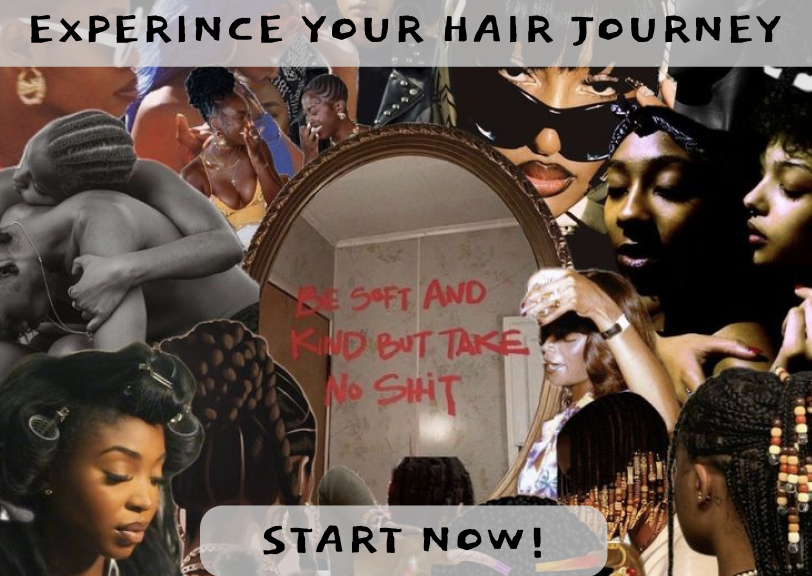

<mark>**Note that this document order from FP4 -> FP1**</mark>

<mark>Please sign up for the study</mark> at [https://tinyurl.com/pui-study](https://tinyurl.com/pui-study) to allow us to use your submission to create a better GenAI assistant for designers!

---

# **FP4 \- Final Project Writeup**

Feel free to refer to this [Markdown Cheat Sheet](https://www.markdownguide.org/cheat-sheet/) to make your writeup more organized, and you can preview your markdown file in VSCode [Markdown editing with Visual Studio Code](https://code.visualstudio.com/docs/languages/markdown#_markdown-preview).

## Part 1: Website Description

Describe your website (300 words).

- What is the purpose of your website?
- Who is the target audience?
- What information do you convey with your website?
- How is it interesting and engaging?

## Part 2: User Interaction

How a user would interact with your website? For each step, briefly but clearly state the interaction type & how we should reproduce it.

1. Interaction type. Click on X on page Y / scroll on page X, etc.
2.

## Part 3: External Tool

Describe what important external tool you used (JavaScript library, Web API, animations, or other). Following the bulleted list format below, reply to each of the prompts.

1. Name of tool1
   - Why did you choose to use it over other alternatives? (2 sentences max)
   - How you used it? (2 sentences max)
   - What does it add to your website? (2 sentences max)
2. Name of tool2

## Part 4: Design Iteration

Describe how you iterated on your prototypes, if at all, including any changes you made to your original design while you were implementing your website and the rationale for the changes. (4-8 sentences max)

## Part 5: Implementation Challenge

What challenges did you experience in implementing your website? (2-4 sentences max)

## Part 6: Generative AI Use and Reflection

Describe how you used Generative AI tools to create this final project (fill in the following information, write \~500 words in total).

Document your use of all GenAI tools — ChatGPT, Copilot, Claude, Cursor, etc. using the template below. Add/Delete rows or bullet points if needed, and replace Tool1/Tool2 with the name of the tool.

### Usage Experiences by Project Aspects

Feel free to edit the column \_ (other?) or add more columns if there's any other aspect in your project you've used the GenAI tools for.

For the following aspects of your project, edit the corresponding table cell to answer:

- _Usage_: Whether you used / did not use this tool for the aspect. Enter [Yes/No]
- _Productivity_: Give a rating on whether this tool makes your productivity for X aspect [1-Much Reduced, 2-Reduced, 3-Slightly Reduced, 4-Not Reduced nor Improved, 5-Slightly Improved, 6-Improved, 7-Much Improved].

| Tool Name | Ratings      | design | plan   | write code | debug  | \_ (other?) |
| :-------- | :----------- | :----- | :----- | :--------- | :----- | :---------- |
| Tool1     | Usage        | Yes/No | Yes/No | Yes/No     | Yes/No | Yes/No      |
| Tool1     | Productivity | 1~7    | 1~7    | 1~7        | 1~7    | 1~7         |
| Tool2     | Usage        | Yes/No | Yes/No | Yes/No     | Yes/No | Yes/No      |
| Tool2     | Productivity | 1~7    | 1~7    | 1~7        | 1~7    | 1~7         |

### Usage Reflection

> Impact on your design and plan

- It matched my expectations and plan in [FP2](#generative-ai-use-plan) in that … For example,
  1. Tool1:
  2. Tool2:
- It did not match my expectations and plan in [FP2](#generative-ai-use-plan) in that … For example,
  1. Tool1:
  2. Tool2:
- GenAI tool did/did not influence my final design and implementation plan because … For example,
  1. Tool1:
  2. Tool2:

> Use patterns

- I accepted the generations when … For example,
  1. Tool1: this tool once suggested … and I adjusted my design according to the suggestion because …
  2. Tool2:
- I critiqued/evaluated the generated suggestions by … For example,
  1. Tool1: this tool once suggested … but I modified/rejected the suggestion because …
  2. Tool2:

> Pros and cons of using GenAI tools

- Pros
  1. Tool1:
  2. Tool2:
- Cons
  1. Tool1:
  2. Tool2:

### Usage Log

Document the usage logs (prompts and chat history links) for the GenAI tools you used. Some tools may not have an easy way to share usage logs, just try your best! Some instructions for different tools:

1. [ChatGPT](https://help.openai.com/en/articles/7925741-chatgpt-shared-links-faq) / [Gemini](https://support.google.com/gemini/answer/13743730?hl=en&co=GENIE.Platform%3DDesktop): share the anonymous link to all of your chat histories relevant to this project
2. [GitHub Copilot (VSCode)](<https://code.visualstudio.com/docs/copilot/copilot-chat#:~:text=You%20can%20export%20all%20prompts%20and%20responses%20for%20a%20chat%20session%20in%20a%20JSON%20file%20with%20the%20Chat%3A%20Export%20Session...%20command%20(workbench.action.chat.export)%20in%20the%20Command%20Palette.>): export chat histories relevant to this project.

---

# **FP3 \- Final Project Check-in**

Document the changes and progress of your project. How have you followed or changed your implementation & GenAI use plan and why? Remember to commit your code to save your progress.

## Implementation Plan Updates

- [ ] ...

## Generative AI Use Plan Updates

- [ ] ...

Remember to keep track of your prompts and usage for [FP4 writeup](#part-6-generative-ai-use-and-reflection).

---

# **FP2 \- Evaluation of the Final project**

## Project Description

As someone who has experince not being familar with there hair texture this was something that was very improtant to me. Many woman of color who have my hair texture or thicker experince not knowing how to style it and what products to use. Liseenced stylist also dont know how to do our hair properly since it actually isnt taught in beauty school circulloum. Although its encourgaged to work on our thick hair it hard to go to stylist who can recommend proper products and do hair styles for us. This will be a good for people who have coily hair texture to learn more about how to take care of their hair.

## High-Fi Prototypes

### _Prototype 1_

Based on the user feedback from the prototype 1 high-fidelity testing, I identified two key areas for improvement. There was multiple entry point confusion. Users expressed uncertainty about where they were entering the application. The initial interface was perceived as resembling a beauty advertisement rather than a haircare platform. This feedback helped me in understanding I need to clarify the purpose and context of my website upon entry. For the second page design, while users found the content of the second page valuable, they felt its visual design was underwhelming. This feedback helped me realized that the page lacked visual appeal and engagement, despite containing useful information.

### _Prototype 2_

## Usability Test

Based on the user feedback from my user testing, I have added new feautures to improve the application's functionality and user experience. I added a new feature that allows users to view their specific hair texture, categorized by porosity levels. To address the feedback about blandness, I incorporated an inviting background to make the interface more visually appealing. I also created an entirely new page dedicated to providing tailored recommendations for users based on their specific hair type. This page includes an explanation of the user's selected hair type from the previous page, a "View Curated List" feature offering personalized product recommendations, and an information section with detailed explanations of various hair types, such as Type 4a. I also wanted user to enjoy the walk through of learning about there hair as well, so I made the background photo curated to women of color because we usually don't proper representation of our beauty.

## Updated Designs

The insights gained from user feedback were important to me as it helped refine my concept. I was able to align with my vision more closely with the needs and preferences of my target audience.

## Feedback Summary

Based on the feedback provided, my classmates suggested I create an easy-to-complete survey that helps users identify their hair type. Upon completion, the website will generate a personalized "About My Hair" page, which will include a curated list of suitable products, recommended protective styles, and an explanation of why their hair has specific characteristics. To make the experience more engaging, I'll incorporate visual elements such as coily hair images for selection, and actual hairstyle images on the recommendation page. I also plan on adding interactive features like a progress bar that animates as users scroll or click through options. To provide more detailed information, I'll include questions about hair porosity, such as whether the hair quickly absorbs water. To further enhance the user experience, I'm considering adding video content, possibly in the form of an iMovie, to demonstrate hair care techniques or styles. The lab session was super helpful as it led me to understand I can address information contact in a way for user to learn and still make it welcoming.

## Milestones

- Completion of high-fidelity prototypes and user testing feedback analysis
- Development of the initial website pages, including the hair type quiz functionality
- Implementation of personalized hair care recommendation system
- Final integration of all features and comprehensive testing of the entire website

### _Implementation Plan_

- [ ] Week 9 Oct 28 \- Nov 1:

  - [x] FP1 due
  - [x] Create 2 hifi on figma
  - [x] Take notes on user feedback from user testing
  - [x] Go to lab and get additonal feedback

- [ ] Week 10 Nov 4 \- Nov 8:

  - [x] FP2 due
  - [ ] Based of lab finalizse my hifi on figma
  - [ ] Start coding first page of website (HTML and CSS)

- [ ] Week 11 Nov 11 \- Nov 15:

  - [ ] Create second page and thrid page of hair quiz with code ( I want to start incorporating JS within my code alongisde adding to my CSS and HTML)
  - [ ] Start coding hair quiz questionare (possibly using a for loop, but will research on this)

- [ ] Week 12 Nov 18 \- Nov 22:

  - [ ] FP3 due
  - [ ] Ask classmates and TA feedback with current pages
  - [ ] Start working on last page (I will need three different hair recommendation pages)
  - [ ] Make sure to continousally update HTML, CSS, and JS as needed

- [ ] Week 13 Nov 25 \- Nov 29:

  - [ ] Try and finish last two pages of hair recommendation page
  - [ ] Add text descriptions to the hair pages after you've built template and since three of the pages will be the same but slighty different text descriptions.
  - [ ] Make sure code passees accessibility
  - [ ] Thanksgiving

- [ ] Week 14 Dec 2 \- Dec 6:
  - [ ] FP4 due

### _Libraries and Other Components_

I plan to have a progress bar to make it an animation throughout the hair quiz.

-

## Generative AI Use Plan

I plan to use Generative AI tools as a supportive resource throughout my website development process, while maintaining control over the core aspects of the project. In Week 10, as I begin coding the first page, I'll utilize AI to clarify complex coding concepts and suggest optimizations for my code snippets. However, I'll write the fundamental code myself to ensure a deep understanding of my website's functionality. During Week 11, while developing the hair quiz pages, I'll leverage AI to help generate question structures and logic flows, aiming for a comprehensive and user-friendly experience. I'll carefully review and adjust these AI-generated suggestions based on my hair care expertise. For the recommendation pages in Weeks 12 and 13, I may use AI to create initial content descriptions for various hair types and care routines. As always I will continue to review and customize this content to guarantee its accuracy and relevance to my target audience. Throughout this entire process, I will prioritize data protection, ensuring that no personal information is shared or compromised. By using AI in this manner, I aim to enhance my development process while maintaining the integrity and uniqueness of my hair care website.

### _Tool Use_

- ChatGPT
  - I will use it for drafting content descriptions for different hair types and care routines. It can help me generate informative and engaging explanations that I can then review and customize.
  - I will use it for brainstorming ideas for user interface design and interactive elements, as it can provide creative suggestions for enhancing user experience.
  - I will not use it for generating my code because it might not be able to help me with executing my vision properly.
  - I will not use it to functionality because I want to know that I am aware of writtng the code myself.

### _Responsible Use_

I plan to use AI responsibly by ensuring that I know how to write my code myself with the support of citing outside resources. This approach will help me maintain a deep understanding of my website's functionality and allow me to make informed decisions about its development. I will also be careful to ask questions that are specific and targeted, focusing on areas where AI can provide valuable insights or suggestions without taking over the core development process.

---

# **FP1 \- Proposal for Critique**

## Idea Sketches

### Idea 1- Sneaker Resell

- What is the basic idea of your final project? (1-2 sentences)

A resell website for people interested in the sneakers, will range from collectors items to used shoes, appealing to all buyers.

- How do you plan to make your design interactive and engaging?

To enhance user engagement, the design will incorporate interactive elements such as clickable product images and a functional shopping cart system, simulating a real purchasing experience.

- How do you plan to make your design accessible?

Accessibility will be prioritized by implementing alt text for images and utilizing semantic HTML elements throughout the website's structure. I will also be making sure to use the https://wave.webaim.org/ tool to evaluate the accessibility of my webpage.

- What information do you specifically want to convey and include on your website?

The website will showcase a wide array of sneakers, emphasizing its appeal to all types of buyers. It will present an enjoyable platform for purchasing both new and vintage sneakers, while also facilitating a shoe trading system for interested collectors.

### Idea 2- Portfolio

- What is the basic idea of your final project? (1-2 sentences)

The project aims to create a personal portfolio that illustrates my professional evolution, bridging my background in public health with my current focus on Human-Computer Interaction (HCI).

- How do you plan to make your design interactive and engaging?

The design will feature interactive elements such as clickable case studies highlighting my passion for health. Additionally, a continuous video will be integrated into the page, which, when clicked, will reveal a timeline of my journey from college to my current professional status.

- How do you plan to make your design accessible?

Accessibility will be prioritized by implementing alt text for images and utilizing semantic HTML elements throughout the website's structure. I will also be making sure to use the https://wave.webaim.org/ tool to evaluate the accessibility of my webpage.

- What information do you specifically want to convey and include on your website?

The website will present a curated selection of my best work while also providing insights into my personal identity. It will serve as a creative platform to narrate my unique story and showcase my professional development.

### Idea 3- African Food Recipes

- What is the basic idea of your final project? (1-2 sentences)

A website dedicated to countries of africa and the food recipes based off popular dishes.

- How do you plan to make your design interactive and engaging?

User engagement will be enhanced through interactive elements such as clickable food images. When users find a recipe of interest, they can click on it to access detailed information about the dish.

- How do you plan to make your design accessible?

Accessibility will be prioritized by implementing alt text for images and utilizing semantic HTML elements throughout the website's structure. I will also be making sure to use the https://wave.webaim.org/ tool to evaluate the accessibility of my webpage.

- What information do you specifically want to convey and include on your website?

The website will present a diverse array of cuisines from all regions of Africa. The goal is to promote African culinary traditions and make them accessible to a global audience, encouraging everyone to explore and try these dishes.

## Feedback Summary

During the lab session, my classmates gave me feedback on my two website projects. For my African Food Recipes website, they had some cool ideas. I was wondering how to categorize regions with content on the main page, and they suggested I could use a scrapbook theme. They liked my idea of having an interactive map on one side of the screen where users could hover over countries. They told me to check out the Eater site for inspiration and to add more content for each region.

I was thinking about having background photos and making the map interactive when you hover over a country. My classmates thought that was good and suggested I look into using Vega-Lite (https://vega.github.io/vega-lite/examples/geo_choropleth.html) to create the map. They also said I should color-code the regions and include both recipes and info about the most represented countries in each area. I asked how I could incorporate an API, JS library or web animation into this idea, and they encouraged me to explore those options. They also thought it would be cool if I could make the recipes downloadable or printable.

For my Resell website for sneakers, I was worried about how to appeal to both buyers who want new and used sneakers. I had this idea of creating a logo with a shoe that's half old and half new, and my classmates liked that. They suggested I have two sections, one for new and one for used sneakers.
I was thinking about how to show the condition of the shoes, and they said I should have full pictures and maybe put a condition grade above each shoe. They also thought I should add filters for shoe brands to make it easier for users to find what they want.

My portfolio will not be of focus for my final project since I already have one live. I will use the other two ideas and narrow and use that to add to my perosnal website.

## Feedback Digestion

Based on the feedback I received during the lab session, I've decided to focus my design on the African Food Recipes website. Being from Nigeria, an African country, I feel more connected to this project. The feedback I received also suggested that this concept has more potential for user interaction and impact. One of the main critiques I'll be acting on is implementing an interactive map on one side of the screen. This feature will allow users to hover over countries for more information, which I think will greatly enhance the user experience and make the site more engaging. I plan to explore using Vega-Lite to create this map, as it seems to offer the functionality I need. I also like the suggestion of color-coding regions and presenting both recipes and information about the most represented countries in each area. This approach will help users quickly identify different regions and provide a more comprehensive cultural context for the recipes. The idea of incorporating a scrapbook theme for the main page is intriguing, and I think it could add a unique visual appeal to the site.

Making recipes downloadable or printable is another suggestion I'll definitely incorporate, as it will add practical value for users who want to try the recipes offline. While I appreciate the suggestion to look into the Eater site for inspiration, I'll be cautious about this to ensure my site maintains its unique identity. I'll use it more as a reference point rather than a direct model. I'm still considering how to best incorporate an API or JavaScript library to make the site more dynamic, which might be a feature I develop in later iterations of the project.

Currently, I am leaning more towards the regions of african country feedback I got to educates users about the rich culinary diversity of the continent. I also did not focus on a portfolio as my TA suggested that the other two ideas could beneift me more since I already have a portfolio website live. I used this feedback to focus on my other two ideas.
